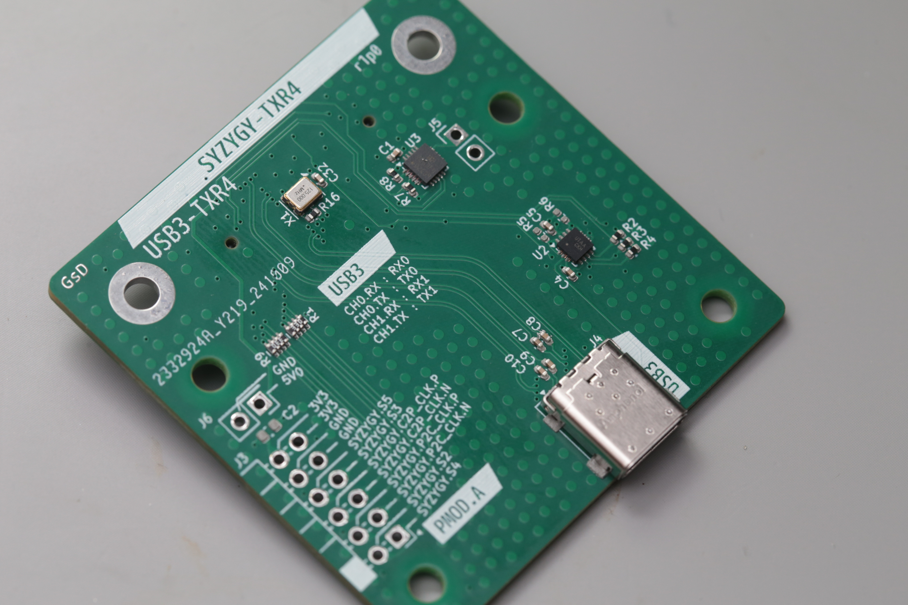

# SYZYGY-TXR4-USB3 breakout

SYZYGY is an FPGA expansion standard for medium to high speed interfaces. Learn more and check out the specifications here: [https://syzygyfpga.io/](https://syzygyfpga.io/)

---

## What is it

A breakout to connect SYZYGYs 5Gbit serdes lanes through to a USB-C connector

Running the gateware luna stack on the FPGA can enumerate as a USB3 device.

## Folder structure

```
kicad-src: KiCad v6 source files
production:
 - Gerbers:      [project]_gerbers.zip
 - Schematic:    [project].pdf
 - Board render: [project].png
```

## Photo

